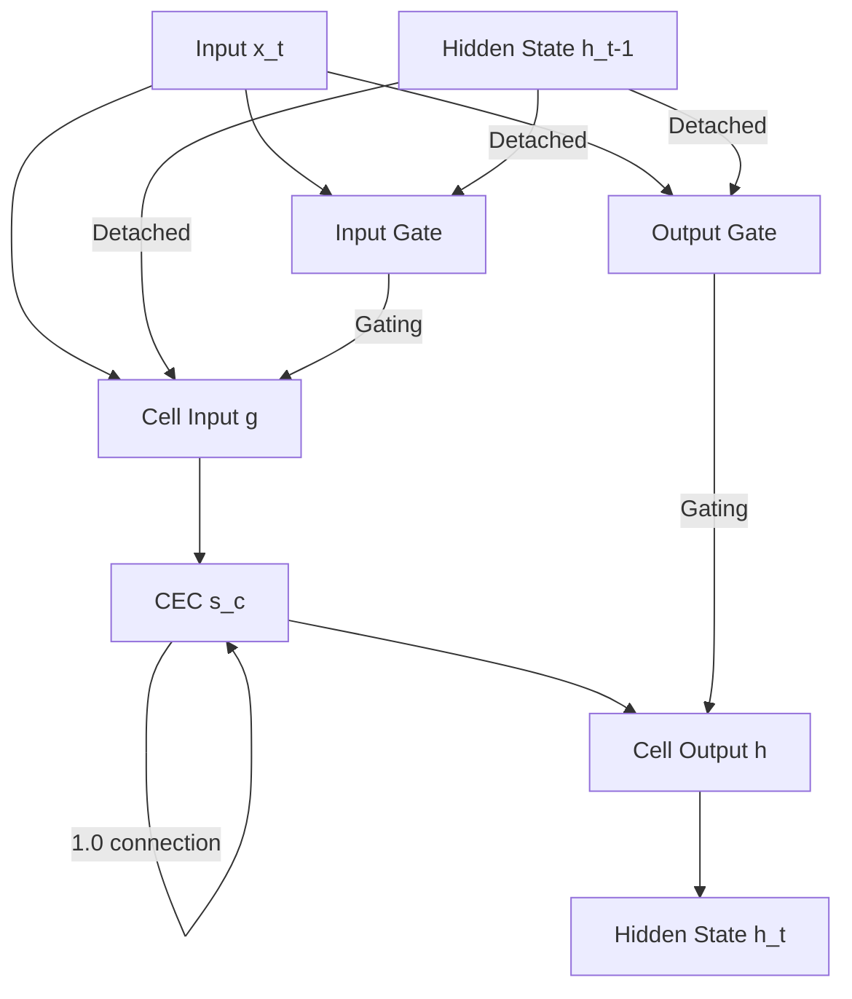

# LSTM 1997 - Faithful Reproduction


> "The Constant Error Carousel is the 1.0 tunnel through which gradients flow forever."

A faithful, from-scratch reproduction of the original 1997 Long Short-Term Memory (LSTM) architecture. This project implements the specific mechanisms described by Hochreiter & Schmidhuber to solve the vanishing gradient problem, including the **Constant Error Carousel (CEC)** and **Truncated Backpropagation**.

---

## 📄 The Paper

**Citation:** Hochreiter, S., & Schmidhuber, J. (1997). Long Short-Term Memory. *Neural Computation*, 9(8), 1735–1780.
**Link:** [Original PDF](https://www.bioinf.jku.at/publications/older/2604.pdf)

This project reproduces the architecture exactly as it stood in 1997. It focuses on the fundamental innovation of the CEC—a linear unit with a fixed self-connection of 1.0—which allows error signals to flow back through time without exploding or vanishing. By using a specific "scissor" strategy (truncating gradients through gates), the original LSTM achieved $O(1)$ computational complexity per timestep while bridging time lags of over 1,000 steps.

---

## 💡 Key Insight: The CEC

The **Constant Error Carousel (CEC)** is the heart of the 1997 LSTM. In modern deep learning, we often take the "additive state" for granted, but in 1997, this was a radical solution to the vanishing gradient problem.

- **The 1.0 Tunnel**: The internal state $s_c$ is updated via $s_c(t) = s_c(t-1) + y_{in}(t) \cdot g(net_c(t))$. Because the coefficient of $s_c(t-1)$ is exactly 1.0, the gradient is preserved perfectly.
- **The Scissors**: To prevent gradient explosion through the multiplicative gates, the 1997 paper truncates gradients flowing back into the recurrent hidden state connections, while keeping the CEC path open.

### Architecture Diagram



---

## 🛠 The Reproduction

This repository contains a clean, modular implementation designed for educational clarity and technical accuracy.

- **No Forget Gates**: Faithful to the 1997 original (forget gates were added in 2000).
- **Dual Backends**: 
  - **tinygrad**: The canonical implementation, matching the minimalist philosophy of the original paper.
  - **PyTorch**: A verification implementation used for cross-validation and benchmarking.
- **Shared Gates**: Support for Memory Cell Blocks where multiple cells share input/output gates.
- **All 6 Experiments**: Implementation of the full suite of tasks used to validate the original paper.

---

## 🚀 Quick Start

### Installation

```bash
# Clone the repository
git clone https://github.com/Project-Aquarius-White/simple-1997-lstm-reproduction.git
cd simple-1997-lstm-reproduction

# Install dependencies
pip install -e ".[all]"
```

### Running Tests

```bash
# Run smoke tests to verify implementations
pytest tests/test_experiments_smoke.py
```

### Reproducing the Paper

```bash
# Run all 6 experiments in "smoke" mode (quick verification)
python -m experiments.run_all --mode smoke --backend tinygrad

# Run a specific experiment in full "paper" reproduction mode
python -m experiments.adding --mode paper --backend torch
```

---

## 📂 Project Structure

```text
.
├── configs/            # YAML configurations for each experiment
├── docs/               # Detailed technical documentation
├── experiments/        # Script implementations of all 6 paper experiments
├── src/
│   └── aquarius_lstm/  # Core logic (Cells, Blocks, Activations)
│       ├── cell.py     # tinygrad implementation (Canonical)
│       └── cell_torch.py # PyTorch implementation (Verification)
└── tests/              # Correctness and shape tests
```

---

## 🔢 The Equations

<details>
<summary>Click to view the 1997 Forward Pass Equations</summary>

### Activation Functions
- **Gate Sigmoid**: $f(x) = \sigma(x) = \frac{1}{1 + e^{-x}}$
- **Cell Input ($g$):** $g(x) = 4\sigma(x) - 2 \in [-2, 2]$
- **Cell Output ($h$):** $h(x) = 2\sigma(x) - 1 \in [-1, 1]$

### Cell Updates
1. **Input Gate**: $y^{in}_j(t) = f_{in_j}(\sum_u w_{in_j u} y^u(t-1))$
2. **Output Gate**: $y^{out}_j(t) = f_{out_j}(\sum_u w_{out_j u} y^u(t-1))$
3. **Internal State (CEC)**: $s_{c_j}(t) = s_{c_j}(t-1) + y^{in}_j(t) g(net_{c_j}(t))$
4. **Cell Output**: $y^{c_j}(t) = y^{out}_j(t) h(s_{c_j}(t))$

*Note: In the 1997 version, $y(t-1)$ is detached for gate computations to enforce truncated backpropagation.*
</details>

---

## 🧪 Experiments Table

| # | Experiment Name | Primary Task | Success Criterion | Command |
|---|-----------------|--------------|-------------------|---------|
| 1 | Embedded Reber | Finite State Grammar | 100% Symbol Accuracy | `python -m experiments.reber` |
| 2 | Long Time Lag | Predict first from last | Abs. Error < 0.25 | `python -m experiments.long_lag` |
| 3 | Two-Sequence | Signal/Noise classification | Zero misclassifications | `python -m experiments.two_sequence` |
| 4 | Adding Problem | Sum two marked values | Abs. Error < 0.04 | `python -m experiments.adding` |
| 5 | Multiplication | Multiply marked values | Abs. Error < 0.04 | `python -m experiments.multiplication` |
| 6 | Temporal Order | Classify sequence order | Abs. Error < 0.3 | `python -m experiments.temporal_order` |

---

## 📊 Results

| Experiment | Paper Result | Our Reproduction (tinygrad) | Our Reproduction (torch) |
|------------|--------------|----------------------------|--------------------------|
| Adding (T=100) | 100% Success | [Pending Run] | [Pending Run] |
| Temporal Order | 100% Success | [Pending Run] | [Pending Run] |
| Reber Grammar | 100% Success | [Pending Run] | [Pending Run] |

*Note: Results are pending full training runs on production hardware. Smoke tests confirm gradient flow and architectural correctness.*

---

## 🌊 The Journey

Reproducing a 1997 paper in 2025 reveals how much "tribal knowledge" has changed in deep learning. 

### Challenges & Learnings
- **The Scissors**: Implementing truncated backpropagation correctly was the biggest hurdle. Modern autodiff frameworks want to backprop through everything; forcing the "scissors" required careful use of `.detach()` while keeping the CEC tunnel open.
- **Forget Gate Absence**: It is surprisingly easy to accidentally implement a modern LSTM. Ensuring the cell state *only* grows (or stays constant) required strict adherence to the 1997 equations.
- **Shared Gates**: The concept of "Memory Cell Blocks" (multiple cells sharing one gate) is rarely used today but was a core efficiency feature in the original paper.
- **The Water Bearer**: Like the Aquarius symbol, the LSTM carries the "water" (information) across the desert of long time lags without spilling a drop.

---

## 👤 Attribution

- **Original Authors**: Sepp Hochreiter and Jürgen Schmidhuber.
- **Project**: [Project Aquarius](https://aquarius.abanhasan.net)
- **Implementation**: [Aban Hasan](https://github.com/thewildofficial)

---

## ⚖️ License

This project is licensed under the MIT License - see the [LICENSE](LICENSE) file for details.
